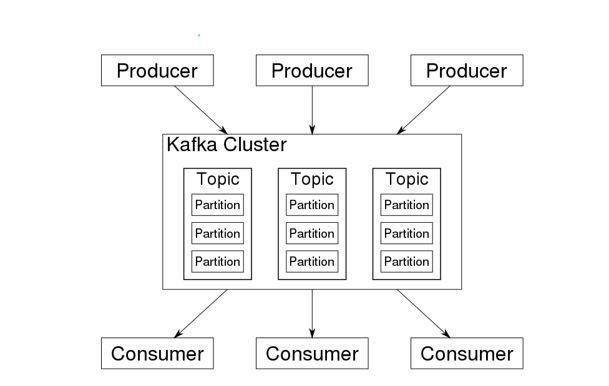
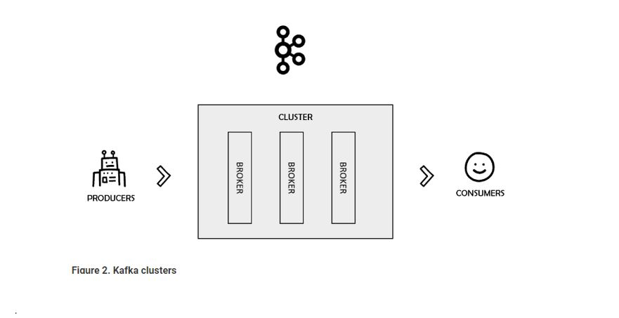
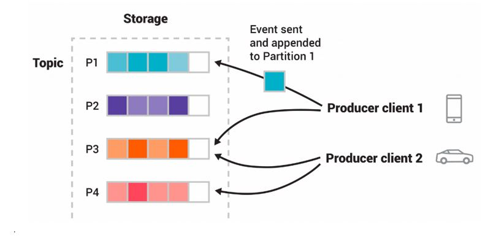

<h1>Sprinboot with Kafka All Examples </h1>  

<h2>Description English</h2>

This Application contains Different examples using Kafka, the producer Project will send a message
to the other Services, and kafka.Infra contains the Docker-compose to create an image of Kafka and Zookeeper,
This project I used different approach as consult to new Projects, the order to follow is consumer to nine-consumer. 

 
<h2>Descrição Português</h2>

Este aplicativo contém exemplos diferentes usando Kafka, o projeto do produtor enviará uma mensagem
para os outros Serviços, e kafka.Infra contém o Docker-compose para criar uma imagem de Kafka e Zookeeper,
Neste projeto, usei uma abordagem diferente como consulta para novos projetos, a ordem a seguir é de consumer para nine-consumer. 

 

 

 
<h2>## Linkedin Below - Linkedin ABaixo</h2>

<h4 align="center">
   Created by   <a href="https://www.linkedin.com/in/luiz-carlos-b50693173/" target="_blank"> Luiz Carlos </a>
</h4>

</html>
